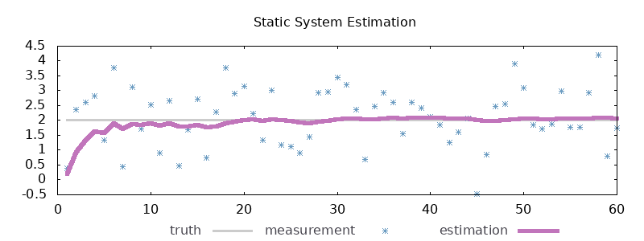
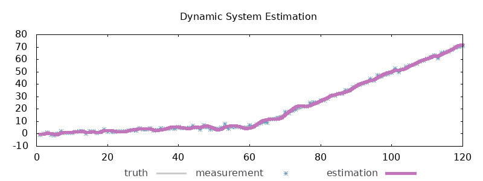

# pg_kalman

A simple [Kalman filter](https://en.wikipedia.org/wiki/Kalman_filter) extension
for PostgreSQL.  Mostly just for fun.

## Static Systems

```sql
/*
 * Filter some noisy measurements of a static true value.  As we make more
 * measurements over time our estimation of the truth should get better.
 */
WITH noisy_data AS (
	SELECT
		time,
		2                    AS truth,
		normal_rand(1,2,1)   AS measurement
	FROM generate_series(1,60) AS time
)
SELECT
	time,
	truth,
	measurement,
	static_filter(measurement,1) AS estimation
FROM noisy_data
```


## Dynamic Systems

```sql
/*
 * Filter some noisy measurements of a one-dimensional dynamic system.  Our
 * estimations should keep up with changes in the system state.
 */
WITH noisy_data AS (
	SELECT
		t                          AS time,
		(t*0.1)                    AS truth,
		normal_rand(1,(t*0.1),1)   AS measurement
	FROM generate_series(1,60) AS t
	UNION
	/* The object just sped up */
	SELECT
		t                                   AS time,
		(t*0.1)+(t-61)                      AS truth,
		normal_rand(1,((t*0.1)+(t-61)),1)   AS measurement
	FROM generate_series(61,120) AS t
)
SELECT
	time,
	truth,
	measurement,
	dynamic_filter(measurement,1) AS estimation
FROM noisy_data
```


## Installing

Build and install the extension.

```bash
make; sudo make install
```

Add `pg_kalman` to your postgres server's `shared_preload_libraries`
configuration and restart the service.

Then create the extension in your postgres client.

```sql
CREATE EXTENSION pg_kalman
```

## Tests

Test coverage depends on these great projects: 

* [pg_tap](https://pgtap.org/)
* [pg_tmp](http://eradman.com/ephemeralpg/)

## Authors

* **Josh Byard** - *Initial work* - [jbyard](https://github.com/jbyard)
